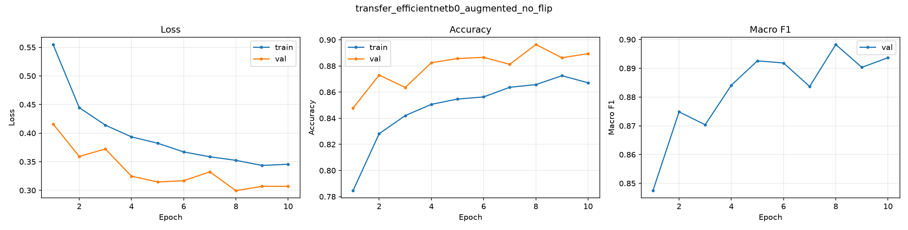
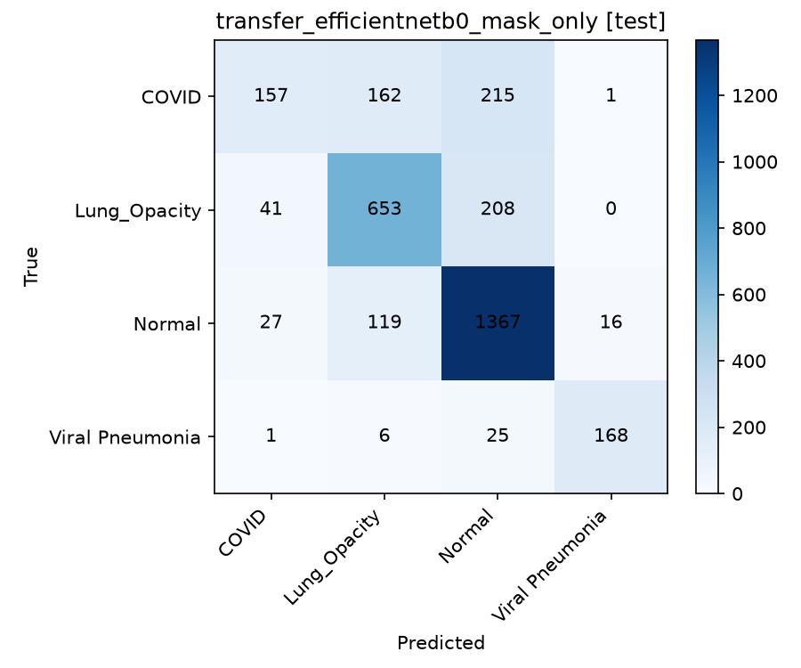
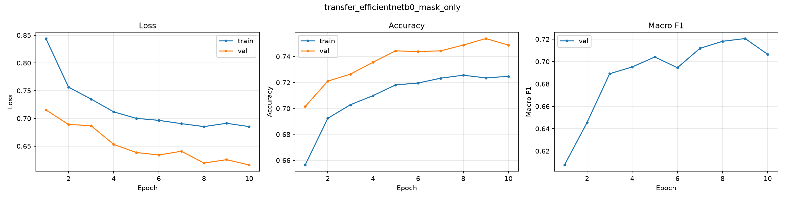
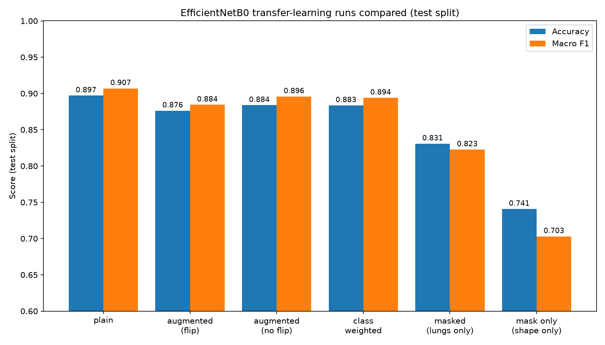

# Grad-CAM & lung-focus analysis (EfficientNetB0 transfer learning)

This report documents an investigation into one question:

> **Does the EfficientNetB0 transfer-learning model actually learn from the lungs, or is it partly relying on background/border cues in the X-ray images?**

This matters because the raw test accuracy (~90%) says nothing about *where* that accuracy comes from. If the model is picking up on artifacts that happen to correlate with a class in this specific dataset (image borders, device markers, positioning, source-hospital signatures), that accuracy would not transfer to new hospitals or scanners — a classic and well-documented risk with this particular Kaggle dataset. This is an educational decision-support study, not a validated diagnostic tool, and this analysis is exactly the kind of check needed before trusting the model's accuracy number at face value.

We answered the question in three stages: **visualize** (Grad-CAM), **quantify** (lung-focus metric), and **prove causally** (train a model that physically cannot see the background). Below is what we did, what we found, and why.

## TL;DR

- Grad-CAM showed the model's attention was only mildly above chance inside the lungs, and for `Lung_Opacity` actually *below* chance.
- Correct and misclassified predictions had virtually identical lung-focus — the weak localization wasn't a special failure mode, it's how the model works generally.
- The proof: we trained an identical model on images with the background forcibly zeroed out (lungs-only). Overall accuracy dropped only 6.6 points, but **COVID recall collapsed from 90.3% to 57.0%** — a 33-point loss concentrated almost entirely in one class. That is direct causal evidence that a large share of the original model's COVID-detection ability came from non-lung cues.

## 1. The three models compared

| Model | Backbone training | Augmentation | Lung masking | Purpose |
| --- | --- | --- | --- | --- |
| `transfer_efficientnetb0` | frozen, ImageNet-pretrained | no | no | Original baseline transfer model |
| `transfer_efficientnetb0_augmented` | frozen, ImageNet-pretrained | yes (flip + rotation) | no | Same, with light augmentation |
| `transfer_efficientnetb0_masked` | frozen, ImageNet-pretrained | no | **yes** (background zeroed) | Causal test: can it still classify with the background removed? |

All three share the same architecture (`GlobalAveragePooling → Dropout → Dense(128) → Dropout → Dense(4, softmax)` on top of a frozen EfficientNetB0), the same 70/15/15 stratified split, and the same seed (42). `transfer_efficientnetb0` and `transfer_efficientnetb0_masked` are the fairest pair to compare, since neither uses augmentation — masking is the only variable that changed between them.

## 2. Tooling built for this analysis

Everything lives in `src/covid_xray/transfer_learning/gradcam.py` (core logic) and `gradcam_cli.py` (command-line entry point), backed by the project's existing lung segmentation masks (the same masks used for the baseline's `region="lungs"/"background"` confound experiment in `training/features.py`).

| Function | What it does |
| --- | --- |
| `build_gradcam_models` | Splits the model into a backbone sub-model (spatial conv features) and a classifier-head sub-model, since the EfficientNet backbone is nested as a single layer inside the outer model. |
| `compute_gradcam_heatmap` | Standard Grad-CAM: gradient of the predicted class w.r.t. the last conv layer (`top_conv`), pooled and used to weight the conv feature maps. |
| `lung_attention_fraction` | Share of the heatmap's total activation that falls inside the lung mask. |
| `summarize_lung_focus` / `aggregate_lung_focus` | Run Grad-CAM over many images and average the lung-attention fraction per class, alongside a **chance baseline** (see below). |
| `aggregate_lung_focus_by_correctness` | Same, but grouped by whether the prediction was correct or wrong. |
| `mask_lungs` (in `TransferConfig` / `dataset.py`) | Zeroes out every pixel outside the lung mask *before* the image reaches the model — used to train `transfer_efficientnetb0_masked`. |
| `apply_mask_to_input` (in the Grad-CAM functions) | Lets Grad-CAM feed the masked model the same masked input it was trained on, for a fair analysis. |

### What "chance" means

The bar charts below always compare two numbers:

- **Grad-CAM in lungs** — the actual, observed share of the model's attention that lands inside the lung mask.
- **Lung area (chance)** — simply how much of the image is lung tissue (typically ~20-26%). This is the score a model would get *by accident* if it paid no attention to anatomy at all and just lit up a random patch of the image.

If the blue bar (observed) is close to the orange bar (chance), the model isn't targeting the lungs any better than random luck. If it's clearly higher, that's real evidence of lung-focused attention. If it's *lower*, the model is actively avoiding the lungs relative to pure geometry.

## 3. Step 1 — Qualitative Grad-CAM on the original model

Running Grad-CAM on `transfer_efficientnetb0_augmented` and overlaying the true lung boundary (green outline) already hinted at a problem: heatmaps often sat at chest borders, shoulders, and corners rather than tightly inside the lungs.


## 4. Step 2 — Quantifying it: lung focus vs. chance

Averaged over 300 sampled test images:

| Class | Grad-CAM in lungs | Chance level | Difference |
| --- | --- | --- | --- |
| COVID | 30.8% | 24.7% | **+6.1 pts** |
| Normal | 28.5% | 25.0% | +3.5 pts |
| Viral Pneumonia | 29.8% | 25.7% | +4.2 pts |
| Lung_Opacity | 17.7% | 20.6% | **−2.9 pts** |


Only mildly above chance for three classes, and *below* chance for `Lung_Opacity` — meaning the model attends to the background more than pure geometry would predict for that class.

## 5. Step 3 — Is it worse when the model is wrong?

Split the same 300 images by whether the prediction was correct:

| Prediction | Grad-CAM in lungs | Chance level | Difference |
| --- | --- | --- | --- |
| Correct (258 images) | 25.4% | 23.7% | +1.7 pts |
| Misclassified (42 images) | 25.2% | 22.5% | +2.8 pts |


Essentially no difference. This told us the weak lung-localization is not a special "error mode" that appears only when the model messes up — it's baked into the model's general behavior, right or wrong. That result was suggestive but still only correlational, so we designed a direct causal test.

## 6. Step 4 — The causal test: train a model that cannot see the background

We retrained the exact same architecture with the lung mask applied to every input image *before* it reaches the network (`--mask-lungs`, no augmentation, otherwise identical settings to the plain baseline). If the model could still classify well, its skill would have to come from the lungs — there is nothing else in the image left to use.

### Result: accuracy dropped, but very unevenly

| Metric | `transfer_efficientnetb0` (full image) | `transfer_efficientnetb0_masked` (lungs only) | Change |
| --- | --- | --- | --- |
| Test accuracy | 89.70% | 83.07% | **−6.6 pts** |
| Test macro F1 | 0.907 | 0.823 | **−8.4 pts** |
| **COVID recall** | 90.3% | **57.0%** | **−33.3 pts** |
| COVID F1 | 0.923 | 0.678 | −24.5 pts |
| Lung_Opacity F1 | 0.854 | 0.809 | −4.5 pts |
| Normal F1 | 0.906 | 0.872 | −3.4 pts |
| Viral Pneumonia F1 | 0.945 | 0.932 | −1.3 pts |

**This is the key finding of the whole analysis.** If the model's accuracy came evenly from lung pathology, removing the background should have hurt every class by a similar amount. Instead, the damage is overwhelmingly concentrated in COVID: recall collapses from 90% to 57%, meaning the masked model now misses 43% of actual COVID cases that the original model used to catch correctly. The other three classes only lose a few points each.

That pattern points squarely at COVID-specific background leakage in the dataset — consistent with the widely reported issue that COVID images in this Kaggle collection were aggregated from different sources than some of the other classes, introducing incidental correlations (borders, markers, image quality) that have nothing to do with the disease itself.

### Grad-CAM on the masked model: attention moves into the lungs

We re-ran the same Grad-CAM analysis on the masked model (feeding it the same masked input it was trained on):

| Class | Grad-CAM in lungs | Chance level | Difference |
| --- | --- | --- | --- |
| COVID | 40.8% | 24.7% | +16.1 pts |
| Lung_Opacity | 30.2% | 20.6% | +9.6 pts |
| Normal | 49.4% | 25.0% | +24.4 pts |
| Viral Pneumonia | 44.4% | 25.7% | +18.7 pts |


Every class is now clearly above chance (roughly double, vs. only slightly above chance for the original model) — as expected, since the network genuinely has nothing but lung tissue to work with.


## 7. "But some heatmaps still show hot spots outside the lungs — even with masking?"

Looking closely at the masked-model grid above, a few heatmaps still light up areas outside the green lung outline. This is *not* a bug in the masking — the model's input genuinely had zero pixels there. It's a fundamental limitation of Grad-CAM on deep CNNs. We confirmed this directly by inspecting the network's internals on a real example:

```
fraction of masked input that is exactly zero: 78%
mean |activation| in background-only conv cells: 1.80
mean |activation| in lung-covering conv cells:    3.31
max activation in background-only conv cells:    14.09
max activation in lung-covering conv cells:      22.86
```

Two things cause this:

1. **Zero input does not mean zero activation deep in the network.** EfficientNetB0 has ~16 stacked convolutional blocks, each with learned bias terms and batch-normalization statistics from ImageNet pretraining. `activation(W·0 + bias)` is not zero — every layer injects its own constant, and this compounds across the network's depth. So a region that started at literal zero still produces a non-trivial, non-zero feature by the final layer (confirmed above: background cells average 1.80 vs. 3.31 for lung cells — weaker, but far from silent).
2. **The heatmap is very coarse and has a huge receptive field.** Grad-CAM here reads from the last conv layer, a 7×7 grid for a 224×224 image — each cell represents roughly a 32×32 pixel block, and its receptive field (the input region it can "see") covers a large fraction of the entire image. That coarse 7×7 grid is then smoothly upsampled back to 224×224 for display, so a hot blob can visually spill several pixels past the true lung boundary from interpolation blur alone.

**Practical takeaway:** don't over-interpret any single heatmap pixel-for-pixel against the mask outline. The aggregated `lung_attention_fraction` statistics (averaged over many images) are what carry statistical weight — and ultimately, the masked-training accuracy experiment (Section 6) is the definitive, unambiguous proof, since it doesn't depend on Grad-CAM's spatial resolution at all.

## 8. Overall conclusion

1. The original transfer-learning model's ~90% test accuracy is real, but **not fully explained by lung pathology**. A meaningful share of it — concentrated almost entirely in the COVID class — comes from non-anatomical shortcuts in the dataset.
2. This should be reported as a central limitation, not hidden behind the headline accuracy number, per this project's standards for treating confounds and domain shift as first-class findings.
3. The lung-masked model (57% COVID recall) is a more *honest* lower bound on what's learnable from lung tissue alone with this architecture and data — at the cost of materially lower raw performance. Whether to prefer this trade-off depends on the application: a model that must be trustworthy for the right reasons vs. one optimized purely for in-distribution accuracy on this dataset.
4. Any deployment or external validation of this model line should specifically watch for COVID-recall collapse on data from new sources, since that is exactly the failure mode this analysis predicts.

## 9. How to reproduce

```bash
# Train the causal-test model (lungs-only input, no augmentation)
covid-xray-train-transfer --epochs 10 --batch-size 32 --mask-lungs \
  --model-name transfer_efficientnetb0_masked

# Grad-CAM + lung-focus report on any saved model
python -m covid_xray.transfer_learning.gradcam_cli \
  --model-path models/transfer_efficientnetb0_masked.keras \
  --processed-dir data/processed \
  --output reports/transfer_learning/transfer_efficientnetb0_masked_gradcam.png \
  --samples-per-class 2 \
  --lung-focus-sample-size 300 \
  --apply-mask-to-input   # only needed when analyzing a model trained with --mask-lungs
```

Tests for all of the above live in `tests/transfer_learning/test_transfer_gradcam.py` and `test_transfer_dataset.py`.

## 10. Files in this folder

| File | Model | Contents |
| --- | --- | --- |
| `transfer_efficientnetb0_metrics.json`, `*_confusion_matrix.png` | plain | Baseline metrics/confusion matrices |
| `transfer_efficientnetb0_augmented_metrics.json`, `*_confusion_matrix.png` | augmented | Metrics/confusion matrices with augmentation |
| `transfer_efficientnetb0_augmented_gradcam.png` | augmented | Qualitative Grad-CAM grid (Section 3) |
| `transfer_efficientnetb0_augmented_lung_focus.{csv,png}` | augmented | Lung focus vs. chance, per class (Section 4) |
| `transfer_efficientnetb0_augmented_lung_focus_by_correctness.{csv,png}` | augmented | Lung focus, correct vs. misclassified (Section 5) |
| `transfer_efficientnetb0_masked_metrics.json`, `*_confusion_matrix.png` | masked | Metrics/confusion matrices for the causal-test model |
| `transfer_efficientnetb0_masked_gradcam.png` | masked | Qualitative Grad-CAM grid on the masked model (Section 6) |
| `transfer_efficientnetb0_masked_lung_focus.{csv,png}` | masked | Lung focus vs. chance after masking (Section 6) |
| `transfer_efficientnetb0_masked_lung_focus_by_correctness.{csv,png}` | masked | Lung focus, correct vs. misclassified, masked model |
| `transfer_efficientnetb0_augmented_no_flip_metrics.json`, `*_confusion_matrix.png` | augmented, no flip | Metrics/confusion matrices for the no-horizontal-flip experiment (Section 12) |
| `transfer_efficientnetb0_augmented_no_flip_history.{json,png}` | augmented, no flip | Per-epoch train/val loss, accuracy, and macro F1 (Section 12) |
| `transfer_efficientnetb0_mask_only_metrics.json`, `*_confusion_matrix.png` | mask only (shape only) | Metrics/confusion matrices for the masks-only-input experiment (Section 13) |
| `transfer_efficientnetb0_mask_only_history.{json,png}` | mask only (shape only) | Per-epoch train/val loss, accuracy, and macro F1 (Section 13) |
| `all_models_test_comparison.png` | all runs | Accuracy/macro F1 bar chart across every run compared (Section 14) |
| `gradcam.png` | — | Scratch/example output from ad hoc CLI runs during development; not a canonical report artifact. |

## 11. Training tooling: history tracking, checkpoints, and run comparison

To make it easy to compare outcomes across different training runs, `run_transfer_learning` now:

- Tracks **validation macro F1 per epoch** (`covid_xray.transfer_learning.callbacks.MacroF1Callback`), since Keras has no built-in multi-class F1 metric. Training-set F1 can also be tracked with `--track-train-f1` (an extra prediction pass per epoch, off by default for speed).
- Saves the full per-epoch history (`loss`, `val_loss`, `accuracy`, `val_accuracy`, `val_macro_f1`) to `{model_name}_history.json`, and plots train-vs-validation curves to `{model_name}_history.png` — the quickest way to eyeball over/underfitting.
- Saves a **model checkpoint after every epoch** to `models/checkpoints/{model_name}/epoch_XXXX.keras` (`--save-checkpoints`, on by default), and supports `--resume` to continue training from the latest checkpoint (the merged history keeps every epoch across the interrupted and resumed runs).
- Exposes `covid_xray.transfer_learning.compare` (`load_metrics`, `model_comparison`, `load_histories`, `plot_metric_across_runs`, `plot_test_comparison`) to pull every saved run's final metrics into one table, overlay any tracked metric (e.g. `val_loss`, `val_macro_f1`) across several runs on one chart, or render a labeled accuracy/macro-F1 bar chart across a chosen set of runs.

## 12. Experiment: does removing horizontal flip help?

Chest X-rays are not left/right symmetric in a clinically meaningless way (heart position, incidental laterality cues in some images), so horizontal flipping — the default in `build_augmentation_pipeline` — could plausibly hurt rather than help. We trained an otherwise-identical model with flipping disabled (`--augment --no-horizontal-flip`, rotation-only augmentation) and compared it against `transfer_efficientnetb0_augmented` (flip + rotation) on the held-out test split:

| Model | Accuracy | Macro F1 | COVID F1 | Lung_Opacity F1 | Normal F1 | Viral Pneumonia F1 |
| --- | --- | --- | --- | --- | --- | --- |
| `transfer_efficientnetb0_augmented` (flip + rotation) | 87.62% | 0.884 | 0.879 | 0.832 | 0.892 | 0.935 |
| `transfer_efficientnetb0_augmented_no_flip` (rotation only) | **88.38%** | **0.896** | 0.883 | **0.850** | 0.895 | **0.956** |

Removing horizontal flipping improved every single metric on the test set — accuracy by +0.76 points and macro F1 by +1.15 points, with the biggest gains on `Lung_Opacity` (+1.85 pts F1) and `Viral Pneumonia` (+2.07 pts F1). This is consistent with the hypothesis that flipping was introducing a mild, unhelpful distribution shift rather than useful invariance for this task. Its own train/val curves (`transfer_efficientnetb0_augmented_no_flip_history.png`) show validation loss tracking below training loss throughout, with no sign of overfitting over 10 epochs.



**Recommendation:** drop horizontal flipping from the default augmentation pipeline for this dataset, or at minimum treat it as a tunable hyperparameter rather than an unquestioned default, and re-verify on any future model that adds flip back in (e.g. together with class weighting or unfreezing).

### Reproduce

```bash
covid-xray-train-transfer --augment --no-horizontal-flip --epochs 10 --batch-size 32 \
  --model-name transfer_efficientnetb0_augmented_no_flip
```

## 13. Experiment: how much can be learned from lung shape alone (masks-only input)?

Section 6's masked model still gave the network real lung *pixels* (texture, density, opacities) — it only removed the background. That leaves an open question: how much of its remaining 83% accuracy came from lung *texture/pathology* versus just lung *shape/geometry*? To isolate shape alone, we trained an identical architecture on the segmentation masks themselves (`--mask-only`) — a binary lung silhouette with zero pixel-intensity information from the original X-ray, resized and duplicated across the 3 input channels EfficientNet expects.

### Result: shape alone is a weak classifier, and COVID suffers the most

| Metric | `transfer_efficientnetb0` (full image) | `transfer_efficientnetb0_masked` (lungs, texture kept) | `transfer_efficientnetb0_mask_only` (shape only) |
| --- | --- | --- | --- |
| Test accuracy | 89.70% | 83.07% | **74.07%** |
| Test macro F1 | 0.907 | 0.823 | **0.703** |
| COVID recall | 90.3% | 57.0% | **29.3%** |
| COVID F1 | 0.923 | 0.678 | 0.413 |
| Normal F1 | 0.906 | 0.872 | 0.818 |
| Lung_Opacity F1 | 0.854 | 0.809 | 0.709 |
| Viral Pneumonia F1 | 0.945 | 0.932 | 0.873 |

Lung shape alone is barely better than a coin flip for COVID (29.3% recall, close to random for a 4-class problem), while `Normal` stays comparatively easy to recognize (F1 0.818) — consistent with `Normal` lungs having a more typical, less distorted silhouette, whereas COVID's radiographic signature is primarily about tissue density and opacity patterns *inside* the lung field rather than its outline. The test confusion matrix makes this concrete: of 535 true COVID X-rays, only 157 were correctly classified, with 215 mistaken for `Normal` and 162 for `Lung_Opacity` — the model, seeing only a lung outline, defaults to shapes that look "unremarkable" or "opaque" far more often than it should.



Training was stable with no overfitting (val loss tracked below train loss throughout, val macro F1 rising smoothly to ~0.72):



### Why this matters

Combined with Section 6, this gives a three-way decomposition of where the original model's accuracy comes from:

1. **~6.6 points** (89.70% → 83.07%) depend on **non-lung background/context** (Section 6's finding).
2. **~9.0 further points** (83.07% → 74.07%) depend on **lung texture and density patterns**, not just shape.
3. The remaining **~74% accuracy** is what pure **lung geometry/silhouette** can achieve on its own — well above the 25% random baseline, but a weak classifier by itself, and specifically unreliable for COVID.

This reinforces Section 8's conclusion from a different angle: COVID classification in this dataset leans heavily on cues outside the lung's shape — partly legitimate texture-based pathology signal, but (per Section 6) also partly background leakage. A shape-only model is the most conservative, most anatomically-grounded baseline in this whole comparison, and it is also the one that struggles most with COVID — reinforcing that COVID recall in the fuller models should not be trusted at face value without the caveats raised throughout this report.

### Reproduce

```bash
covid-xray-train-transfer --epochs 10 --batch-size 32 --mask-only \
  --model-name transfer_efficientnetb0_mask_only
```

## 14. All EfficientNetB0 transfer-learning runs, compared

Every run below shares the same architecture, split, and seed (Section 1); only the setting named is changed. Generated with `covid_xray.transfer_learning.compare.plot_test_comparison`.



| Model | Setting changed | Test accuracy | Test macro F1 | Train-test accuracy gap | Train-test F1 gap |
| --- | --- | --- | --- | --- | --- |
| `transfer_efficientnetb0` | none (plain baseline) | **89.70%** | **0.907** | 2.77 pts | 2.67 pts |
| `transfer_efficientnetb0_augmented` | + flip & rotation augmentation | 87.62% | 0.884 | 2.72 pts | 2.66 pts |
| `transfer_efficientnetb0_augmented_no_flip` | + rotation-only augmentation | 88.38% | 0.896 | **1.98 pts** | **1.27 pts** |
| `transfer_efficientnetb0_class_weighted` | + balanced class weights | 88.34% | 0.894 | 3.30 pts | 3.24 pts |
| `transfer_efficientnetb0_masked` | lungs-only input, texture kept (causal test) | 83.07% | 0.823 | 1.30 pts | 0.69 pts |
| `transfer_efficientnetb0_mask_only` | lung silhouette only, no texture (Section 13) | 74.07% | 0.703 | 2.19 pts | 2.18 pts |

Takeaways:

- **The plain baseline still has the highest raw accuracy and F1** of the non-masked models — but Section 6 shows a meaningful share of that is background leakage rather than lung pathology, so it shouldn't be read as "the best model" without that caveat.
- **Augmentation without flipping is the best-calibrated of the full-image models**: close to the plain baseline's F1 (0.896 vs 0.907) while roughly halving the train-test generalization gap (1.98 vs 2.77 accuracy points, 1.27 vs 2.67 F1 points) — i.e. less overfitting for a small accuracy cost. This combines the findings of Sections 6 and 12: it's a genuine step towards a model that generalizes better, even though it can't fix the underlying background-leakage confound by itself.
- **Flipping specifically hurt** (Section 12): augmented-with-flip is worse than augmented-without-flip on every test metric.
- **Class weighting improves recall on the minority classes** (see the per-split breakdowns in Section 10's linked JSON files) but doesn't reduce the generalization gap — it's solving a different problem (class imbalance) than augmentation is (overfitting).
- **The masked model has the smallest train-test gap** by a wide margin, but only because it was deprived of the (partly non-anatomical) signal the other models exploit — its lower absolute accuracy is the price of removing that confound, not evidence of a "better" model in isolation.
- **The mask-only model is the weakest performer overall, and by far the worst on COVID** (Section 13) — it confirms that lung *shape* carries only modest class signal on its own, and that COVID in particular is not a "shape" diagnosis in this dataset. Its train-test gap (2.18-2.19 pts) sits between the full-image and lungs-only-texture models, suggesting shape-only features generalize reasonably but simply don't carry enough signal to compete on raw accuracy.

None of these numbers should be read as a final ranking: they answer different questions (raw performance vs. generalization gap vs. causal validity), and the project's central limitation — dataset-level confounds around the COVID class — applies to all of them except the two masked variants. See Section 8 for the overall conclusion.
