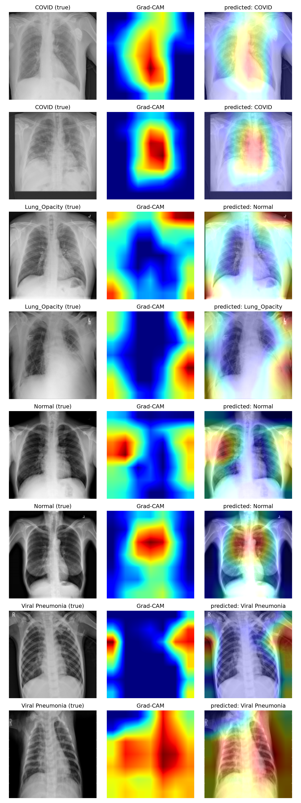
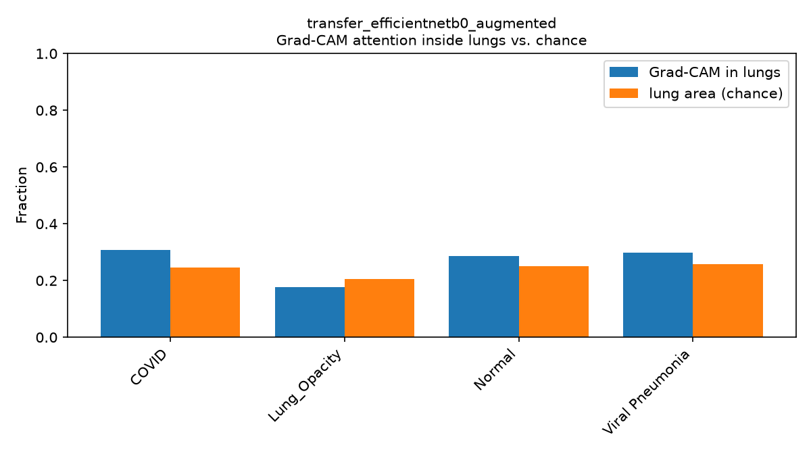
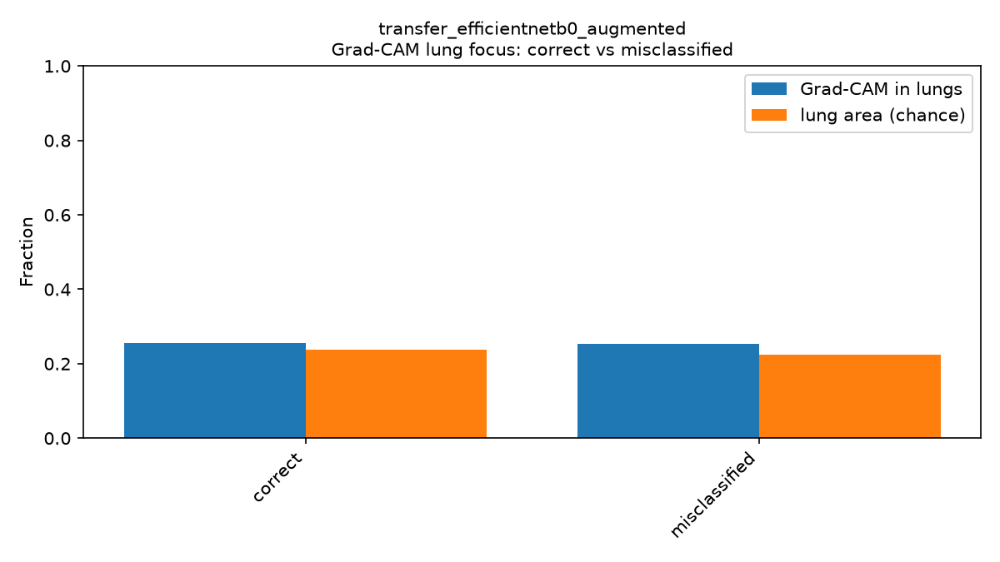
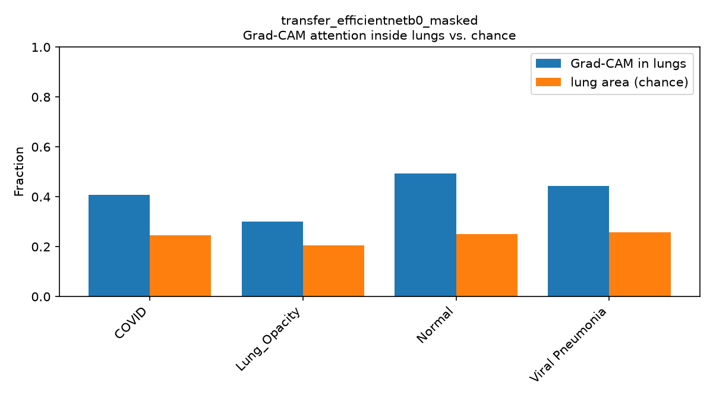
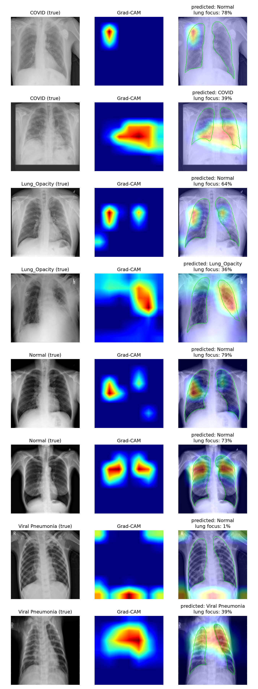

# Grad-CAM & lung-focus analysis (EfficientNetB0 transfer learning)

This report documents an investigation into one question:

> **Does the EfficientNetB0 transfer-learning model actually learn from the lungs, or is it partly relying on background/border cues in the X-ray images?**

This matters because the raw test accuracy (~90%) says nothing about *where* that accuracy comes from. If the model is picking up on artifacts that happen to correlate with a class in this specific dataset (image borders, device markers, positioning, source-hospital signatures), that accuracy would not transfer to new hospitals or scanners — a classic and well-documented risk with this particular Kaggle dataset. This is an educational decision-support study, not a validated diagnostic tool, and this analysis is exactly the kind of check needed before trusting the model's accuracy number at face value.

We answered the question in three stages: **visualize** (Grad-CAM), **quantify** (lung-focus metric), and **prove causally** (train a model that physically cannot see the background). Below is what we did, what we found, and why.

## TL;DR

- Grad-CAM showed the model's attention was only mildly above chance inside the lungs, and for `Lung_Opacity` actually *below* chance.
- Correct and misclassified predictions had virtually identical lung-focus — the weak localization wasn't a special failure mode, it's how the model works generally.
- The proof: we trained an identical model on images with the background forcibly zeroed out (lungs-only). Overall accuracy dropped only 6.6 points, but **COVID recall collapsed from 90.3% to 57.0%** — a 33-point loss concentrated almost entirely in one class. That is direct causal evidence that a large share of the original model's COVID-detection ability came from non-lung cues.

## 1. The three models compared

| Model | Backbone training | Augmentation | Lung masking | Purpose |
| --- | --- | --- | --- | --- |
| `transfer_efficientnetb0` | frozen, ImageNet-pretrained | no | no | Original baseline transfer model |
| `transfer_efficientnetb0_augmented` | frozen, ImageNet-pretrained | yes (flip + rotation) | no | Same, with light augmentation |
| `transfer_efficientnetb0_masked` | frozen, ImageNet-pretrained | no | **yes** (background zeroed) | Causal test: can it still classify with the background removed? |

All three share the same architecture (`GlobalAveragePooling → Dropout → Dense(128) → Dropout → Dense(4, softmax)` on top of a frozen EfficientNetB0), the same 70/15/15 stratified split, and the same seed (42). `transfer_efficientnetb0` and `transfer_efficientnetb0_masked` are the fairest pair to compare, since neither uses augmentation — masking is the only variable that changed between them.

## 2. Tooling built for this analysis

Everything lives in `src/covid_xray/transfer_learning/gradcam.py` (core logic) and `gradcam_cli.py` (command-line entry point), backed by the project's existing lung segmentation masks (the same masks used for the baseline's `region="lungs"/"background"` confound experiment in `training/features.py`).

| Function | What it does |
| --- | --- |
| `build_gradcam_models` | Splits the model into a backbone sub-model (spatial conv features) and a classifier-head sub-model, since the EfficientNet backbone is nested as a single layer inside the outer model. |
| `compute_gradcam_heatmap` | Standard Grad-CAM: gradient of the predicted class w.r.t. the last conv layer (`top_conv`), pooled and used to weight the conv feature maps. |
| `lung_attention_fraction` | Share of the heatmap's total activation that falls inside the lung mask. |
| `summarize_lung_focus` / `aggregate_lung_focus` | Run Grad-CAM over many images and average the lung-attention fraction per class, alongside a **chance baseline** (see below). |
| `aggregate_lung_focus_by_correctness` | Same, but grouped by whether the prediction was correct or wrong. |
| `mask_lungs` (in `TransferConfig` / `dataset.py`) | Zeroes out every pixel outside the lung mask *before* the image reaches the model — used to train `transfer_efficientnetb0_masked`. |
| `apply_mask_to_input` (in the Grad-CAM functions) | Lets Grad-CAM feed the masked model the same masked input it was trained on, for a fair analysis. |

### What "chance" means

The bar charts below always compare two numbers:

- **Grad-CAM in lungs** — the actual, observed share of the model's attention that lands inside the lung mask.
- **Lung area (chance)** — simply how much of the image is lung tissue (typically ~20-26%). This is the score a model would get *by accident* if it paid no attention to anatomy at all and just lit up a random patch of the image.

If the blue bar (observed) is close to the orange bar (chance), the model isn't targeting the lungs any better than random luck. If it's clearly higher, that's real evidence of lung-focused attention. If it's *lower*, the model is actively avoiding the lungs relative to pure geometry.

## 3. Step 1 — Qualitative Grad-CAM on the original model

Running Grad-CAM on `transfer_efficientnetb0_augmented` and overlaying the true lung boundary (green outline) already hinted at a problem: heatmaps often sat at chest borders, shoulders, and corners rather than tightly inside the lungs.



## 4. Step 2 — Quantifying it: lung focus vs. chance

Averaged over 300 sampled test images:

| Class | Grad-CAM in lungs | Chance level | Difference |
| --- | --- | --- | --- |
| COVID | 30.8% | 24.7% | **+6.1 pts** |
| Normal | 28.5% | 25.0% | +3.5 pts |
| Viral Pneumonia | 29.8% | 25.7% | +4.2 pts |
| Lung_Opacity | 17.7% | 20.6% | **−2.9 pts** |



Only mildly above chance for three classes, and *below* chance for `Lung_Opacity` — meaning the model attends to the background more than pure geometry would predict for that class.

## 5. Step 3 — Is it worse when the model is wrong?

Split the same 300 images by whether the prediction was correct:

| Prediction | Grad-CAM in lungs | Chance level | Difference |
| --- | --- | --- | --- |
| Correct (258 images) | 25.4% | 23.7% | +1.7 pts |
| Misclassified (42 images) | 25.2% | 22.5% | +2.8 pts |



Essentially no difference. This told us the weak lung-localization is not a special "error mode" that appears only when the model messes up — it's baked into the model's general behavior, right or wrong. That result was suggestive but still only correlational, so we designed a direct causal test.

## 6. Step 4 — The causal test: train a model that cannot see the background

We retrained the exact same architecture with the lung mask applied to every input image *before* it reaches the network (`--mask-lungs`, no augmentation, otherwise identical settings to the plain baseline). If the model could still classify well, its skill would have to come from the lungs — there is nothing else in the image left to use.

### Result: accuracy dropped, but very unevenly

| Metric | `transfer_efficientnetb0` (full image) | `transfer_efficientnetb0_masked` (lungs only) | Change |
| --- | --- | --- | --- |
| Test accuracy | 89.70% | 83.07% | **−6.6 pts** |
| Test macro F1 | 0.907 | 0.823 | **−8.4 pts** |
| **COVID recall** | 90.3% | **57.0%** | **−33.3 pts** |
| COVID F1 | 0.923 | 0.678 | −24.5 pts |
| Lung_Opacity F1 | 0.854 | 0.809 | −4.5 pts |
| Normal F1 | 0.906 | 0.872 | −3.4 pts |
| Viral Pneumonia F1 | 0.945 | 0.932 | −1.3 pts |

**This is the key finding of the whole analysis.** If the model's accuracy came evenly from lung pathology, removing the background should have hurt every class by a similar amount. Instead, the damage is overwhelmingly concentrated in COVID: recall collapses from 90% to 57%, meaning the masked model now misses 43% of actual COVID cases that the original model used to catch correctly. The other three classes only lose a few points each.

That pattern points squarely at COVID-specific background leakage in the dataset — consistent with the widely reported issue that COVID images in this Kaggle collection were aggregated from different sources than some of the other classes, introducing incidental correlations (borders, markers, image quality) that have nothing to do with the disease itself.

### Grad-CAM on the masked model: attention moves into the lungs

We re-ran the same Grad-CAM analysis on the masked model (feeding it the same masked input it was trained on):

| Class | Grad-CAM in lungs | Chance level | Difference |
| --- | --- | --- | --- |
| COVID | 40.8% | 24.7% | +16.1 pts |
| Lung_Opacity | 30.2% | 20.6% | +9.6 pts |
| Normal | 49.4% | 25.0% | +24.4 pts |
| Viral Pneumonia | 44.4% | 25.7% | +18.7 pts |



Every class is now clearly above chance (roughly double, vs. only slightly above chance for the original model) — as expected, since the network genuinely has nothing but lung tissue to work with.



## 7. "But some heatmaps still show hot spots outside the lungs — even with masking?"

Looking closely at the masked-model grid above, a few heatmaps still light up areas outside the green lung outline. This is *not* a bug in the masking — the model's input genuinely had zero pixels there. It's a fundamental limitation of Grad-CAM on deep CNNs. We confirmed this directly by inspecting the network's internals on a real example:

```
fraction of masked input that is exactly zero: 78%
mean |activation| in background-only conv cells: 1.80
mean |activation| in lung-covering conv cells:    3.31
max activation in background-only conv cells:    14.09
max activation in lung-covering conv cells:      22.86
```

Two things cause this:

1. **Zero input does not mean zero activation deep in the network.** EfficientNetB0 has ~16 stacked convolutional blocks, each with learned bias terms and batch-normalization statistics from ImageNet pretraining. `activation(W·0 + bias)` is not zero — every layer injects its own constant, and this compounds across the network's depth. So a region that started at literal zero still produces a non-trivial, non-zero feature by the final layer (confirmed above: background cells average 1.80 vs. 3.31 for lung cells — weaker, but far from silent).
2. **The heatmap is very coarse and has a huge receptive field.** Grad-CAM here reads from the last conv layer, a 7×7 grid for a 224×224 image — each cell represents roughly a 32×32 pixel block, and its receptive field (the input region it can "see") covers a large fraction of the entire image. That coarse 7×7 grid is then smoothly upsampled back to 224×224 for display, so a hot blob can visually spill several pixels past the true lung boundary from interpolation blur alone.

**Practical takeaway:** don't over-interpret any single heatmap pixel-for-pixel against the mask outline. The aggregated `lung_attention_fraction` statistics (averaged over many images) are what carry statistical weight — and ultimately, the masked-training accuracy experiment (Section 6) is the definitive, unambiguous proof, since it doesn't depend on Grad-CAM's spatial resolution at all.

## 8. Overall conclusion

1. The original transfer-learning model's ~90% test accuracy is real, but **not fully explained by lung pathology**. A meaningful share of it — concentrated almost entirely in the COVID class — comes from non-anatomical shortcuts in the dataset.
2. This should be reported as a central limitation, not hidden behind the headline accuracy number, per this project's standards for treating confounds and domain shift as first-class findings.
3. The lung-masked model (57% COVID recall) is a more *honest* lower bound on what's learnable from lung tissue alone with this architecture and data — at the cost of materially lower raw performance. Whether to prefer this trade-off depends on the application: a model that must be trustworthy for the right reasons vs. one optimized purely for in-distribution accuracy on this dataset.
4. Any deployment or external validation of this model line should specifically watch for COVID-recall collapse on data from new sources, since that is exactly the failure mode this analysis predicts.

## 9. How to reproduce

```bash
# Train the causal-test model (lungs-only input, no augmentation)
covid-xray-train-transfer --epochs 10 --batch-size 32 --mask-lungs \
  --model-name transfer_efficientnetb0_masked

# Grad-CAM + lung-focus report on any saved model
python -m covid_xray.transfer_learning.gradcam_cli \
  --model-path models/transfer_efficientnetb0_masked.keras \
  --processed-dir data/processed \
  --output reports/transfer_learning/transfer_efficientnetb0_masked_gradcam.png \
  --samples-per-class 2 \
  --lung-focus-sample-size 300 \
  --apply-mask-to-input   # only needed when analyzing a model trained with --mask-lungs
```

Tests for all of the above live in `tests/transfer_learning/test_transfer_gradcam.py` and `test_transfer_dataset.py`.

## 10. Files in this folder

| File | Model | Contents |
| --- | --- | --- |
| `transfer_efficientnetb0_metrics.json`, `*_confusion_matrix.png` | plain | Baseline metrics/confusion matrices |
| `transfer_efficientnetb0_augmented_metrics.json`, `*_confusion_matrix.png` | augmented | Metrics/confusion matrices with augmentation |
| `transfer_efficientnetb0_augmented_gradcam.png` | augmented | Qualitative Grad-CAM grid (Section 3) |
| `transfer_efficientnetb0_augmented_lung_focus.{csv,png}` | augmented | Lung focus vs. chance, per class (Section 4) |
| `transfer_efficientnetb0_augmented_lung_focus_by_correctness.{csv,png}` | augmented | Lung focus, correct vs. misclassified (Section 5) |
| `transfer_efficientnetb0_masked_metrics.json`, `*_confusion_matrix.png` | masked | Metrics/confusion matrices for the causal-test model |
| `transfer_efficientnetb0_masked_gradcam.png` | masked | Qualitative Grad-CAM grid on the masked model (Section 6) |
| `transfer_efficientnetb0_masked_lung_focus.{csv,png}` | masked | Lung focus vs. chance after masking (Section 6) |
| `transfer_efficientnetb0_masked_lung_focus_by_correctness.{csv,png}` | masked | Lung focus, correct vs. misclassified, masked model |
| `gradcam.png` | — | Scratch/example output from ad hoc CLI runs during development; not a canonical report artifact. |
